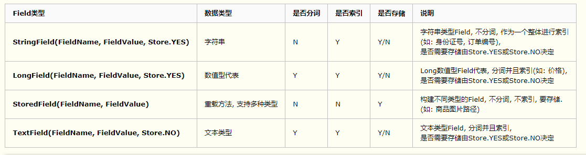

## lucene介绍

- https://lucene.apache.org/

> Lucene Core is a Java library providing powerful indexing and search features, as well as spellchecking, hit highlighting and advanced analysis/tokenization capabilities.

> Apache Lucene™ is a high-performance, full-featured text search engine library written entirely in Java. It is a technology suitable for nearly any application that requires full-text search, especially cross-platform.

## lucene架构


## 概念

- lucene write / read(search)
- **Lucene Field**
- 倒排索引【doc -> field -> term】
- **Lucene Query API**
- Analyzer 分词器

### lucene field

```text
Document(文档)是Field(域)的承载体, 一个Document由多个Field组成. Field由名称和值两部分组成, Field的值是要索引的内容, 也是要搜索的内容.

是否分词(tokenized)
是: 将Field的值进行分词处理, 分词的目的是为了索引. 如: 商品名称, 商品描述. 这些内容用户会通过输入关键词进行查询, 由于内容多样, 需要进行分词处理建立索引.
否: 不做分词处理. 如: 订单编号, 身份证号, 是一个整体, 分词以后就失去了意义, 故不需要分词.

是否索引(indexed)
是: 将Field内容进行分词处理后得到的词(或整体Field内容)建立索引, 存储到索引域. **索引的目的是为了搜索. **如: 商品名称, 商品描述需要分词建立索引. 订单编号, 身份证号作为整体建立索引. **只要可能作为用户查询条件的词, 都需要索引. **
否: 不索引. 如: 商品图片路径, 不会作为查询条件, 不需要建立索引.

是否存储(stored)
是: 将Field值保存到Document中. 如: 商品名称, 商品价格. **凡是将来在搜索结果页面展现给用户的内容, 都需要存储. **
否: 不存储. 如: 商品描述. 内容多格式大, 不需要直接在搜索结果页面展现, 不做存储. 需要的时候可以从关系数据库取.
```



### 倒排索引

- document》索引中的**文档**
- field》文档中的**字段**
- term》字段中的**项**：字段被分词后/或者没有分词可以检索的项【如果某个字段没有被分词那么term就等同于field】

检索就是基于term为关键词去反向搜索到相关的doc【**倒排索引**】

```text
TERM     DOC(s)
term1 -> [1, 2, 3 ,4]
term2 -> [1, 2, 5 ,4]
term3 -> [2, 3 ,4]
term4 -> [1, 2, 3 ,10]
term5 -> [2, 3 ,4]
...

比如：检索spring关键词获得相关文档1234 / 检索lucene关键词获得相关文档2678【倒排索引】【正排的话就是通过遍历文档去找关键词】
TERM      DOC(s)
spring -> [1, 2, 3, 4]
lucene -> [2, 6, 7, 8]
...

```


## Field / Query【★★★】

- 基于Query表达式语法【需要导入lucene-queryparser包】
- 基于Query API【★】


> Lucene操作：【Field的构建 / Query API的使用】

## 参考

- lucene/es参考：https://www.cnblogs.com/shoufeng/category/1259723.html
- Query参考：https://www.javacodegeeks.com/2015/09/advanced-lucene-query-examples.html

## TIPS

- 测试文档是vim的doc文档
- luke在lucene的下载压缩包里面【lucene-8.8.1\luke\luke.bat】【注意：luke版本和lucene版本最好一样】


