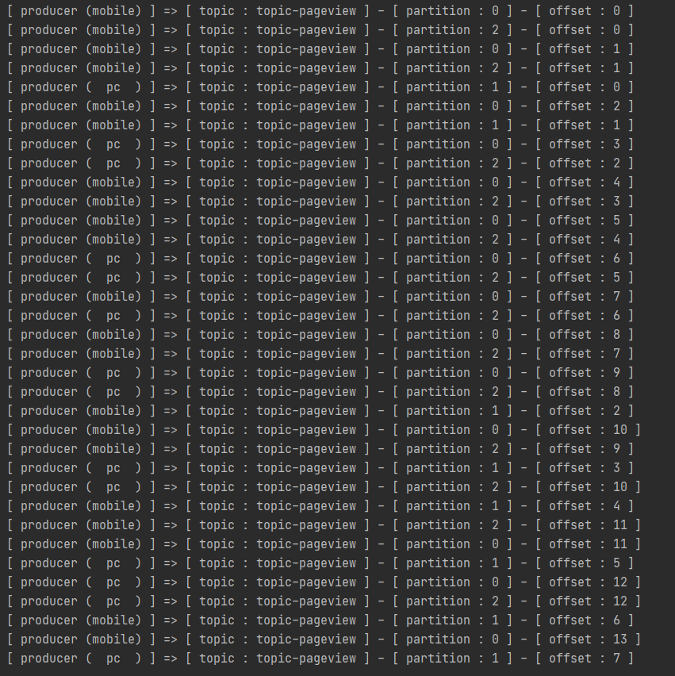
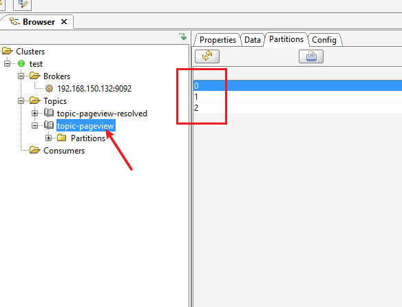
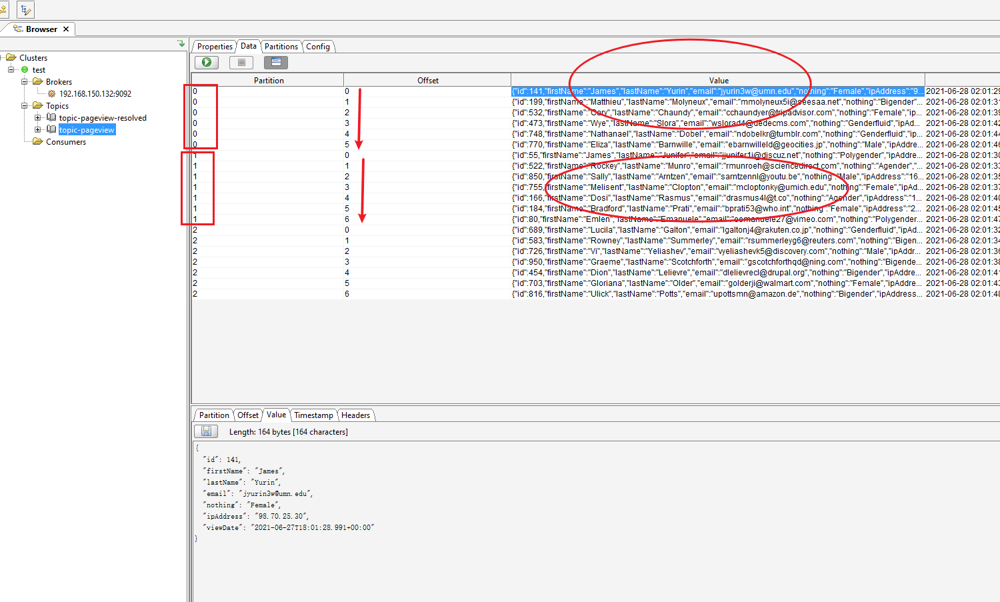
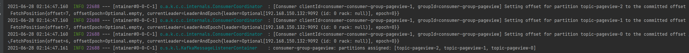
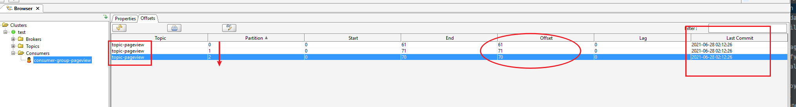
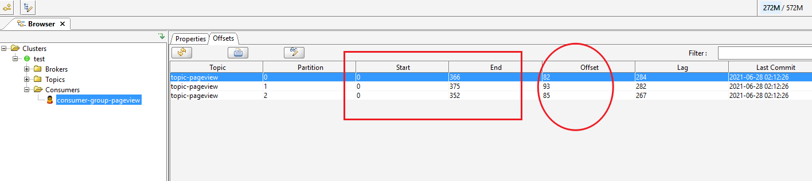
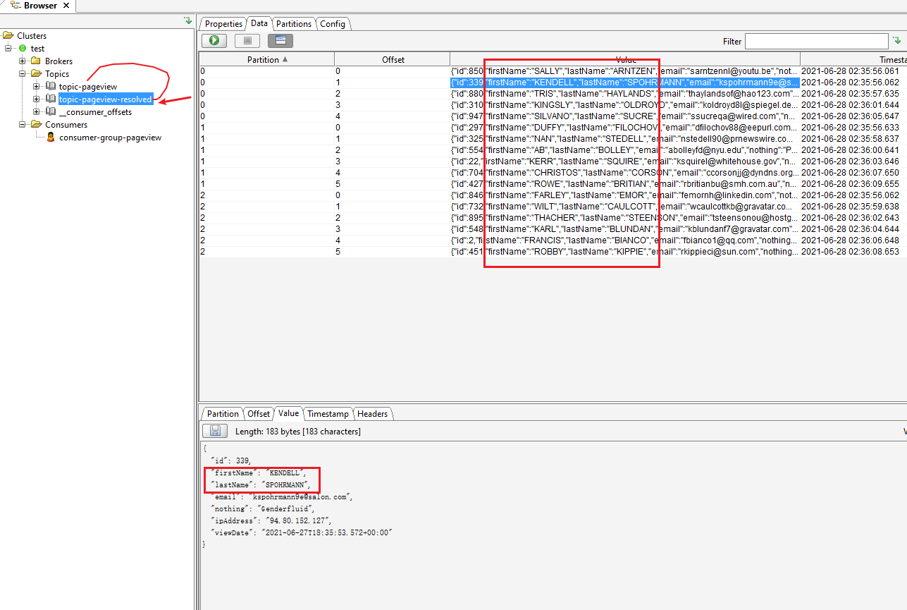

## springboot kafka

## kafka介绍

> link: https://kafka.apache.org/documentation/#quickstart

Kafka is a distributed event streaming platform that lets you read, write, store, and process events (also called
records or **messages** in the documentation) across many machines.

## kafka生产者

首先spring初始化会新建topic（如果不存在的话）

然后开始模拟多个producer发送数据：

**基于topic选择一个随机的partition往里面推数据，通过offset记录位置【也就是说topic-partition-offset就可以定位一条数据】**




## kafka消费者

消费者组对应topic的每个partition都会有消费之后提交的offset记录【所以spring初始化时，（基于配置中从最早处消费：如果没有消费记录就从最早处消费，有消费记录就设置消费offset）】



此时消费者停止消费了一段时间，下次会从消费提交记录中offset开始继续：


重新启动消费：【初始化时消费者组每个partition都会获取committed offset FetchPosition，然后从这里继续】

```text
[Consumer clientId=consumer-consumer-group-pageview-1, groupId=consumer-group-pageview] Setting offset for partition topic-pageview-2 to the committed offset FetchPosition{offset=85, offsetEpoch=Optional.empty, currentLeader=LeaderAndEpoch{leader=Optional[192.168.150.132:9092 (id: 0 rack: null)], epoch=0}}
[Consumer clientId=consumer-consumer-group-pageview-1, groupId=consumer-group-pageview] Setting offset for partition topic-pageview-1 to the committed offset FetchPosition{offset=93, offsetEpoch=Optional.empty, currentLeader=LeaderAndEpoch{leader=Optional[192.168.150.132:9092 (id: 0 rack: null)], epoch=0}}
[Consumer clientId=consumer-consumer-group-pageview-1, groupId=consumer-group-pageview] Setting offset for partition topic-pageview-0 to the committed offset FetchPosition{offset=82, offsetEpoch=Optional.empty, currentLeader=LeaderAndEpoch{leader=Optional[192.168.150.132:9092 (id: 0 rack: null)], epoch=0}}
consumer-group-pageview: partitions assigned: [topic-pageview-2, topic-pageview-1, topic-pageview-0]
```

## kafka再生产消费

(p -> topic1 -> c) => (p -> topic2 -> c) => ... 【也就是说基于topic作为数据中转站，可以无限中转，就是官网上提到的**event streaming**】


## ObjectMapper read json file

> link: https://attacomsian.com/blog/jackson-read-json-file

## kafka gui

> link: https://www.kafkatool.com/download.html

## TODO

- 单节点 VS 多节点（分布式）Kafka ★★★


